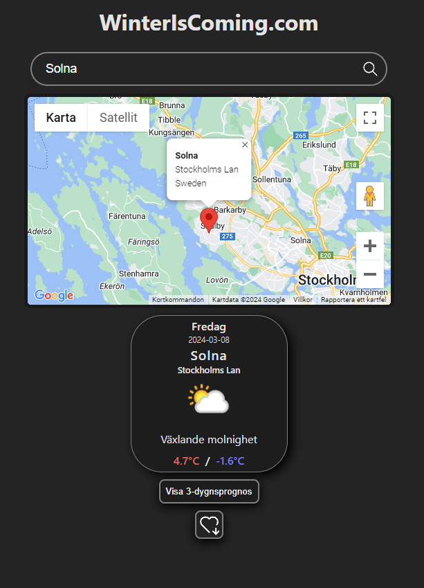
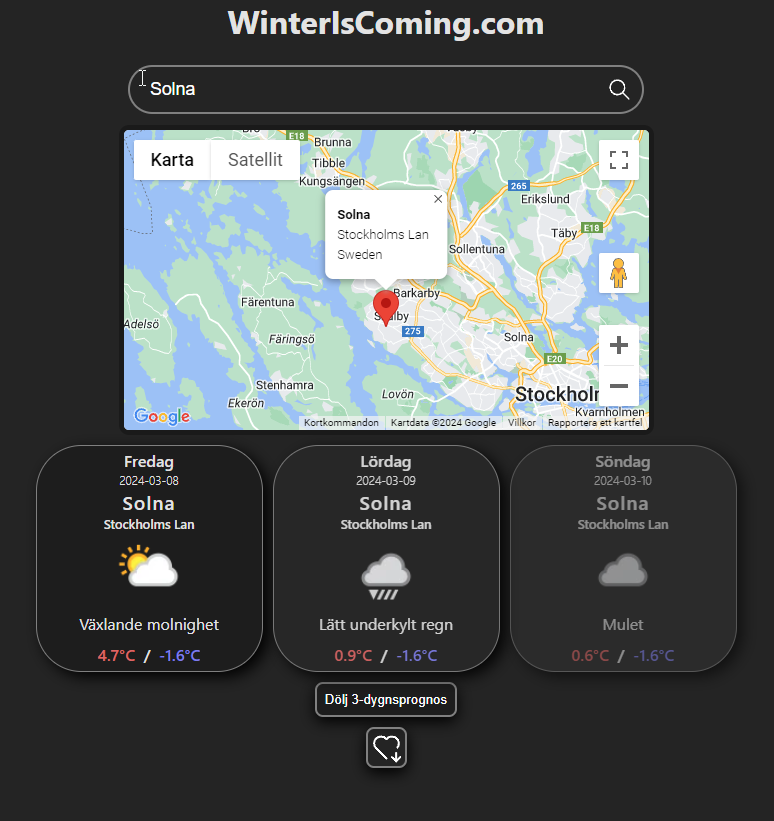
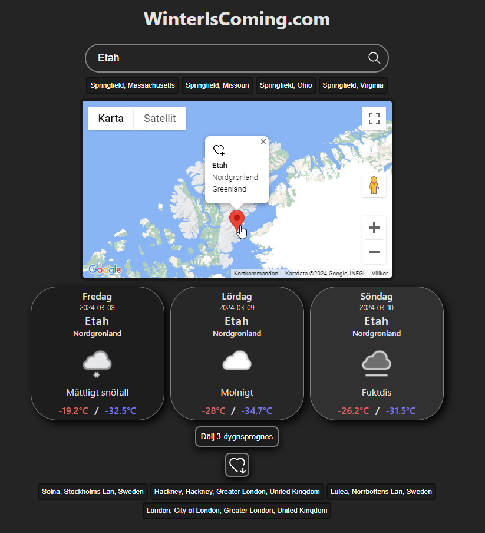
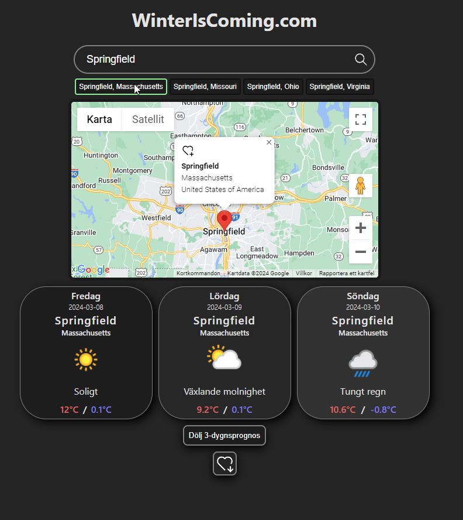

# React Weather App with Location Visualization

   

## Project Overview
This repository contains a weather app built using React that retrieves weather data from the WeatherAPI. Additionally, it utilizes the Google Maps API to visually select locations for weather information. The app includes features to fetch weather data for the current location and save favorite locations.

## Features
### Weather Data Retrieval:
Fetches real-time weather data from the WeatherAPI.

### Location Visualization:
Utilizes Google Maps API for a visual interface to select locations.

### Current Location Weather:
Retrieves weather information for the user's current location.

### Favorite Locations:
Allows users to save and access weather data for their favorite locations.

### Technologies Used
React: Front-end library for building the user interface.

WeatherAPI: External API for retrieving weather data.

Google Maps API: Integration for location visualization.
